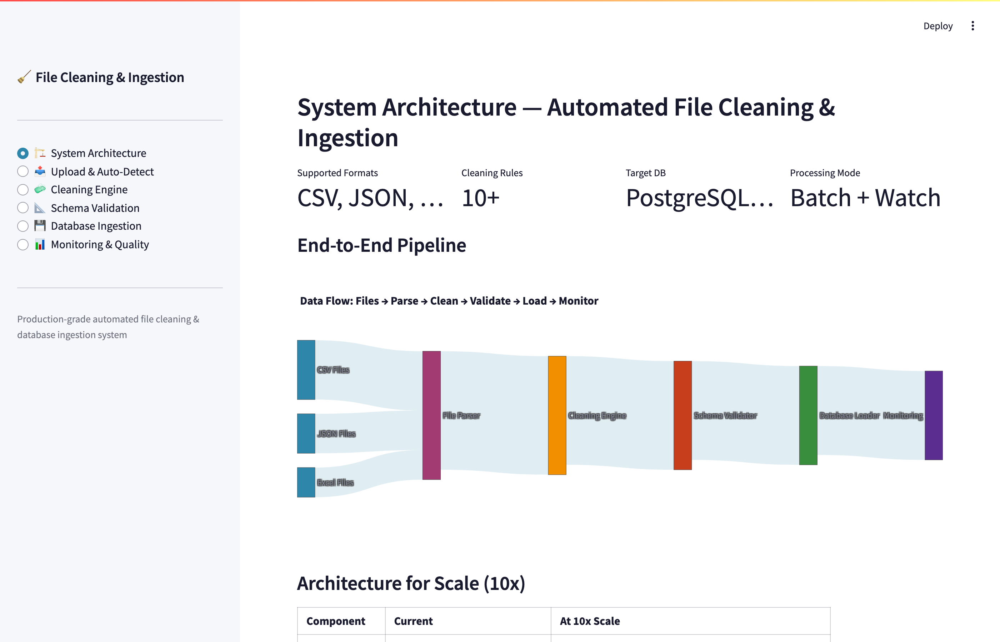

# Automated File Cleaning & Database Ingestion Demo

An interactive Streamlit application demonstrating an **automated file cleaning engine** — with intelligent data detection, configurable cleaning rules, schema validation, and production-ready database ingestion with UPSERT logic.

**[View Live Demo](https://anualli-demo-file-cleaning-ingestion.streamlit.app)**

---

## What This Project Demonstrates

This demo simulates a real-world automated data cleaning and ingestion system, showcasing:

- **Smart File Detection** that auto-identifies column types, data formats, and quality issues on upload
- **10-Rule Cleaning Engine** with animated processing: whitespace trimming, name standardization, date normalization, duplicate removal, null handling, email validation, score clamping, and more
- **Schema Validation** with configurable target schema definitions and pass/fail checks for every column
- **Database Ingestion** that writes cleaned data to SQLite using UPSERT (INSERT ON CONFLICT) with live SQL code display
- **Quality Monitoring** with trend charts, processing history, error logs, and data completeness scores

The app uses intentionally messy sample data with real-world issues (extra spaces, mixed date formats, invalid emails, out-of-range values) and cleans it step by step with a visual progress bar.

---

## Screenshots

### System Architecture
End-to-end flow from file upload through cleaning, validation, and database ingestion.



### Upload & Auto-Detect
Smart detection of column types, quality issues, and data patterns from uploaded files.


### Cleaning Engine
10-rule processing pipeline with animated progress bar — each rule applied and tracked in real time.


### Schema Validation
Target schema definition with type checking, nullable constraints, and pass/fail validation results.


### Database Ingestion
Live SQLite ingestion with UPSERT logic, row counts, and auto-generated SQL code display.


### Monitoring & Quality
Quality score trends, processing history, error logs, and data completeness dashboards.


---

## Tech Stack

- **Processing:** Python, pandas
- **Database:** SQLite (UPSERT with INSERT ON CONFLICT)
- **Validation:** Schema-driven type checking and constraint enforcement
- **Visualization:** Streamlit, Plotly
- **Languages:** Python, SQL

## Run Locally

```bash
pip install -r requirements.txt
streamlit run app.py
```

## License

MIT
